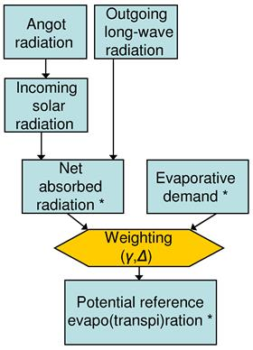

# 2. Potential reference evapo(trans)piration

## Penman-Monteith equation

Reference values for **potential evapotranspiration and evaporation** are estimated using the Penman-Monteith equation (Supit *et al*., 1994, Supit & Van Der Goot, 2003).Specifically, the **potential reference evapotranspiration rate [mm/day]** for the reference vegetation canopy is computed as follows:

$$
ET0 = \frac{\Delta R_{na} + \gamma EA}{\Delta + \gamma}
$$

where 
&nbsp;&nbsp;&nbsp;&nbsp;$ET_0$:&nbsp;&nbsp; is the potential evapotranspiration rate from reference vegetation canopy (closed vegetation canopy) $[\frac{mm}{day}]$ 
&nbsp;&nbsp;&nbsp;&nbsp;$R_{na}$:&nbsp;&nbsp;	is the net absorbed radiation for the reference vegetation canopy $[\frac{mm}{day}]$ 
&nbsp;&nbsp;&nbsp;&nbsp;$EA$:&nbsp;&nbsp;	is the evaporative demand of the reference vegetation canopy $[\frac{mm}{day}]$ 
&nbsp;&nbsp;&nbsp;&nbsp;$\Delta$:&nbsp;&nbsp;		is the slope of the saturation vapour pressure curve $[\frac{mbar}{^\circ C}]$ 
&nbsp;&nbsp;&nbsp;&nbsp;$\gamma$:&nbsp;&nbsp;		is the psychrometric constant $[\frac{mbar}{^\circ C}]$

The same equation is also used to estimate the potential evaporation from a water surface and the evaporation from a (wet) bare soil surface. This purpose is achieved by using different values for the net absorbed radiation term and for the evaporative demand. 

The **potential evaporation rate from a bare soil surface [mm/day]** is then estimated by:

$$
ES = \frac{\Delta R_{na,s} + \gamma EA_s}{\Delta + \gamma}
$$

Finally, the **potential evaporation rate from water surface [mm/day]** is computed as follows:

$$
EW = \frac{\Delta R_{na,w} + \gamma EA_w}{\Delta + \gamma}
$$

where $R_{na,s}$ and $R_{na,w}$ are the net absorbed radiation of bare soil surface and the net absorbed radiation of water surface, respectively ($[\frac{mm}{day}]$); $EA_s$ and $EA_w$ are the evaporative demand of bare soil surface and the evaporative demand of water surface, respectively ($[\frac{mm}{day}]$).

The procedure to calculate potential evapo(transpi)ration is summarised in the following Figure.

**Figure:** *Overview of procedure to calculate potential reference evapo(transpi)ration. Terms with an asterisk (\*) are calculated separately for a reference vegetation canopy, a bare soil surface and an open water surface, respectively.*

 
The table below lists the properties of the reference surfaces that are used in the computation of $ET_0$, $ES_0$ and $EW_0$, respectively. 

|           | **α** *(surface albedo)* | **fc** *(empirical constant in evaporative demand equation)* |
| -------   | ------------------------ | ------------------------------------------------------------ |
| **$ET0$** | 0.23                     | 1                                                            |
| **$ES0$** | 0.15                     | 0.75                                                         |
| **$EW0$** | 0.05                     | 0.5                                                          |

 
 

## Calculating net absorbed radiation

Calculating the net absorbed radiation term involves the following two steps:

1. Calculate the Angot radiation (daily extra-terrestrial radiation)
2. Calculate the net absorbed radiation

Some data sets (e.g. ERA5) provide pre-calculated values for both incoming solar radiation and net long-wave radiation. When both the datasets are available, LISVAP offers the possibility to use these values directly. Conversely, LISVAP applies the following protocol to compute the Angot radiaton.  

### Step 1: Angot radiation (daily extra-terrestrial radiation)

The **daily extra-terrestrial radiation** is the product of the solar constant at the top of the atmosphere and the integral of the solar height over the day:

$$
R_{a,d} = S_{c, d} \int sin \ \beta \ dt_h
$$

where 
&nbsp;&nbsp;&nbsp;&nbsp;$R_{a,d}$:&nbsp;&nbsp;		Daily extra-terrestrial radiation $[{\frac{J}{m^2 \ day}}]$ 
&nbsp;&nbsp;&nbsp;&nbsp;$S_{c,d}$:&nbsp;&nbsp;		Solar constant at the top of the atmosphere $[{\frac{J}{m^2 \ s}}]$ 
&nbsp;&nbsp;&nbsp;&nbsp;$\int sin \ \beta \ dt_h$:&nbsp;&nbsp;	Integral of the solar height over the day $[s]$
 

  The **solar constant** on a given day is calculated as:

$$
S_{c, d} = S_c(1 + 0.033 \cos[\frac{360 \ t_d}{365}])
$$

where 
&nbsp;&nbsp;&nbsp;&nbsp;$S_c$:&nbsp;&nbsp;		 Average solar radiation at the top of the atmosphere $[{\frac{J}{m^2 \ s}}]$ (= 1370 ${\frac{J}{m^2 \ s}}$) 
&nbsp;&nbsp;&nbsp;&nbsp;$S_{c,d}$:&nbsp;&nbsp;	Solar constant at the top of the atmosphere $[{\frac{J}{m^2 \ s}}]$ 
&nbsp;&nbsp;&nbsp;&nbsp;$t_d$:&nbsp;&nbsp;		Calendar day number (1st of January is 1, etcetera) $[-]$
 
  The calendar day number is always a number between 1 and 365.25 (taking into account leap years, a year has on average 365.25 days). 

 
  The **integral of the solar height** equals:

$$
\int sin \beta \ dt_h = 3600(L_d \cdot sin \ \delta \cdot sin \ \lambda + \frac{24}{\pi} \cdot cos \ \delta \cdot cos \ \lambda \cdot \sqrt{1-(tan \ \delta \cdot tan \ \lambda)^2})
$$

where 
&nbsp;&nbsp;&nbsp;&nbsp;$L_d$:&nbsp;&nbsp;	Astronomical day length $[h]$ 
&nbsp;&nbsp;&nbsp;&nbsp;$\delta$:&nbsp;&nbsp;		Solar declination $[^\circ]$ 
&nbsp;&nbsp;&nbsp;&nbsp;$\lambda$:&nbsp;&nbsp;		Latitude $[^\circ]$

  The **solar declination** is a simple function of the calendar day number (*td*):

$$
\delta = -23.45 \cdot cos[\frac{360(t_d + 10)}{365}]
$$

  The **day length** is given by:

$$  \begin{cases} L_d = 12+ \frac{24}{180} \alpha sin(B_{ld})   &[B_{ld} \ge 0]\\ L_d = 12+ \frac{24}{180} [\alpha sin(B_{ld}) - 360] & [B_{ld} < 0]\end{cases} $$ 

with:

$$
B_{ld} = \frac{-sin (\frac{PD}{\pi})+sin \ \delta \cdot sin \ \lambda}{cos \ \delta \cdot \ cos \ \lambda}
$$

where *PD* is a correction constant (-2.65).

### Step 2: Net absorbed radiation 

The net absorbed radiation is calculated for three reference surfaces:
1. Reference vegetation canopy
2. Bare soil surface
3. Open water surface

The following equation is used to calculate the **net long-wave radiation**[[1\]](#_ftn1) (Maidment, 1993):

$$
R_{nl}= f \epsilon \sigma (T_{av}+273)^4
$$

where 
&nbsp;&nbsp;&nbsp;&nbsp;$R_{nl}$:&nbsp;&nbsp;		Net long-wave radiation $[{\frac{J}{m^2 \ day}}]$ 
&nbsp;&nbsp;&nbsp;&nbsp;$\sigma$:&nbsp;&nbsp;			Stefan Boltzmann constant:  $4.903 \cdot 10^{-3}[{\frac{J}{m^2 \ K^4 \ day}}]$ 
&nbsp;&nbsp;&nbsp;&nbsp;$f$:&nbsp;&nbsp;			Adjustment factor for cloud cover 
&nbsp;&nbsp;&nbsp;&nbsp;$\epsilon$:&nbsp;&nbsp;			Net emissivity between the atmosphere and the ground

The **net emissivity** is calculated as:

$$
\epsilon = 0.56 - 0.079 \sqrt{e_a}
$$

where 
&nbsp;&nbsp;&nbsp;&nbsp;$e_a$:&nbsp;&nbsp;			Actual vapour pressure $[mbar]$

The **actual vapour pressure** *ea* can be provided as input data or computed as a function of the surface pressure and of the near-surface specific humidity:

$$
e_a = \frac{( P_{surf} \cdot Q_{air} )}{62.2}
$$

where 
&nbsp;&nbsp;&nbsp;&nbsp;$P_{surf}$:&nbsp;&nbsp;		instantaneous sea level pressure  $[pa]$ 
&nbsp;&nbsp;&nbsp;&nbsp;$Q_{air}$:&nbsp;&nbsp;		2 m instantaneous specific humidity [-]

Alternatively, when the weather stations provide the dew point temperature $T_{dew}$, the actual vapour pressure can be computed using the Goudriaan formula (1977):

$$
e_s= 6.10588 \cdot e^{\frac{17.32491 \cdot T_{dew}}{T_{dew}+238.102}}
$$
 

The equation of Allen (1994) is used to estimate the **cloud cover factor**:

$$
f= (1.8 \cdot Trans_{Atm} - 0.35) 
$$

where 
&nbsp;&nbsp;&nbsp;&nbsp;$f$:&nbsp;&nbsp; Cloud cover adjustment factor [-] in between [0,1] 
&nbsp;&nbsp;&nbsp;&nbsp;$Trans_{Atm}$:&nbsp;&nbsp; Atmospheric transition [-]

$$
Trans_{Atm}=\frac{R_{g,d}}{R_{so}}
$$ 

where $R_{g,d}$ is the daily-extra terrestrial radiation or the downward short wave radiation $R_{d,s}$, depending on the meteo set available. 
$R_{so}$ is a function of the Angot Radiation $R_{a,d}$ and of the altitude $z$ (given by the Digital Elevation Model):

$$
R_{so}= R_{a,d} \cdot (0.75 + ( 2 \cdot 10^5 \cdot z))
$$

Finally, the **net absorbed radiation** [mm day-1] is calculated as:

$$
R_{na}=\frac{(1- \alpha)R_{g,d}-R_{nl}}{L}
$$

where 
&nbsp;&nbsp;&nbsp;&nbsp;$\alpha$:&nbsp;&nbsp; Albedo (reflection coefficient) of the surface, the values are: $\alpha=0.23$ for the reference vegetation canopy, $\alpha=0.15$ for bare soil surface, and $\alpha=0.05$ for an open water surface (as indicated in the table at the beginning of this page) 
&nbsp;&nbsp;&nbsp;&nbsp;$R_{g,d}$:&nbsp;&nbsp; Daily-extra terrestrial radiation or downward short wave radiation $R_{d,s}$ (depending on the available dataset) 
&nbsp;&nbsp;&nbsp;&nbsp;$R_{nl}$:&nbsp;&nbsp; Net long-wave radiation 
&nbsp;&nbsp;&nbsp;&nbsp;$L$:&nbsp;&nbsp; **Latent heat of vaporization** $[\frac{MJ}{kg}]$

**$L$** is computed as follows:

$$
L=2.501-2.361 \cdot 10^{-3} \cdot T_{av}
$$

The net absorbed radiation is calculated for three cases: the reference vegetation canopy ($\alpha=0.23$), a bare soil surface ($\alpha=0.15$), and an open water surface ($\alpha=0.05$).

## Evaporative demand of the atmosphere

The **evaporative demand** of the atmosphere is calculated as:

$$
EA= 0.26(e_s-e_a)(f_c+BU \cdot u(2))
$$

where 
&nbsp;&nbsp;&nbsp;&nbsp;$EA$:&nbsp;&nbsp;		Evaporative demand $[\frac{mm}{day}]$ 
&nbsp;&nbsp;&nbsp;&nbsp;$e_s$:&nbsp;&nbsp;			Saturated vapour pressure $[mbar]$ 
&nbsp;&nbsp;&nbsp;&nbsp;$e_a$:&nbsp;&nbsp;			Actual vapour pressure $[mbar]$ 
&nbsp;&nbsp;&nbsp;&nbsp;$f_c$:&nbsp;&nbsp;			Empirical   constant $[-]$, the values are $fc =1.0$ for the reference vegetation canopy, $fc =0.75$ for a bare soil surface, and $fc =0.5$ for an open water surface (as indicated in the table at the beginning of this page) 
&nbsp;&nbsp;&nbsp;&nbsp;$BU$:&nbsp;&nbsp;		Coefficient in wind function $[-]$ 
&nbsp;&nbsp;&nbsp;&nbsp;$u(2)$:&nbsp;&nbsp;		Mean wind speed at 2 m height $[\frac{m}{s}]$

The **Saturated vapour pressure** is calculated as a function of mean daily air temperature:

$$
e_s= 6.10588 \cdot e^{\frac{17.32491 \cdot T_{av}}{T_{av}+238.102}}
$$

The coefficient in the wind function, $BU$, also depends on the temperature:

$$
BU=max[0.54+0.35 \frac{\Delta T-12}{4}, 0.54]
$$

Here, $\Delta T$ is the difference between the daily maximum and minimum temperature. The equation implies that $BU$ has a fixed value of 0.54 if $\Delta T$ is less than 12°C.

Since wind speed is usually measured at a height of 10 m, the following correction is made (Maidment (1993), p. 4.36):

$$
u(2)=0.749 \cdot u(10)
$$

where $u(10)$ is  the measured wind speed at 10 m height $[\frac{m}{s}]$.
 

Similar to the calculation of the net absorbed radiation, the evaporative demand is calculated for three cases: for a reference vegetation canopy (using $fc =1.0$), a bare soil surface ($fc =0.75$), and an open water surface ($fc =0.5$).  

## Psychrometric constant

The psychrometric constant at sea level can be calculated as:

$$
\gamma_0 = 0.00163 \frac{P_0}{L}
$$

where 
&nbsp;&nbsp;&nbsp;&nbsp;$\gamma_0$:&nbsp;&nbsp;			Psychrometric   constant at sea level (about 0.67) $[\frac{mbar}{^\circ C}]$ 
&nbsp;&nbsp;&nbsp;&nbsp;$P_0$:&nbsp;&nbsp;		Atmospheric   pressure at sea level $[mbar]$ 
&nbsp;&nbsp;&nbsp;&nbsp;$L$:&nbsp;&nbsp;			Latent heat of   vaporization $[\frac{MJ}{kg}]$
 
Since the barometric pressure changes with altitude, so does the psychrometric constant. The following altitude correction is applied (Allen *et al*., 1998):

$$
\gamma(z)= \gamma_0(\frac{293-0.0065 \cdot z}{293})^{5.26}
$$

where 
&nbsp;&nbsp;&nbsp;&nbsp;$\gamma(z)$:&nbsp;&nbsp;		Psychrometric constant at altitude *z* $[\frac{mbar}{^\circ C}]$ 
&nbsp;&nbsp;&nbsp;&nbsp;$z$:&nbsp;&nbsp;			Altitude above sea level $[m]$

## Slope of the saturation vapour pressure curve

The slope of the saturation vapour pressure curve is calculated as follows:

$$
\Delta=\frac{238.102 \cdot 17.32491 \cdot e_s}{(T+238.102)^2}
$$

where $\Delta$ is in $[\frac{mbar}{^\circ C}]$.

## Potential evapo(transpi)ration

As explained before, potential evapo(transpi)ration is calculated for three reference surfaces:

1. A closed canopy of some reference crop ($ET0$)
2. A bare soil surface ($ES0$)
3. An open water surface ($EW0$)
 

These quantities are all calculated using the Penman-Monteith equation, but using different values for the net absorbed radiation (*Rna*) and evaporative demand (*EA*): 

$$
ET0 = \frac{\Delta R_{na}+\gamma EA}{\Delta + \gamma}
$$

$$
ES0 = \frac{\Delta R_{na,s}+\gamma EA_s}{\Delta + \gamma}
$$

$$
EW0 = \frac{\Delta R_{na,w}+\gamma EA_w}{\Delta + \gamma}
$$

where 
&nbsp;&nbsp;&nbsp;&nbsp;$ET0$:&nbsp;&nbsp;		Potential evapotranspiration for reference crop $[\frac{mm}{day}]$ 
&nbsp;&nbsp;&nbsp;&nbsp;$ES0$:&nbsp;&nbsp;		Potential evaporation for bare soil surface $[\frac{mm}{day}]​$ 
&nbsp;&nbsp;&nbsp;&nbsp;$EW0$:&nbsp;&nbsp;		Potential evaporation for open water surface $[\frac{mm}{day}]$ 
&nbsp;&nbsp;&nbsp;&nbsp;$R_{na}$:&nbsp;&nbsp;		Net absorbed radiation, reference crop $[\frac{mm}{day}]$ 
&nbsp;&nbsp;&nbsp;&nbsp;$R_{na,s}$:&nbsp;&nbsp;		Net absorbed radiation, bare soil surface $[\frac{mm}{day}]$ 
&nbsp;&nbsp;&nbsp;&nbsp;$R_na,w$:&nbsp;&nbsp;	Net absorbed radiation, open water surface $[\frac{mm}{day}]$ 
&nbsp;&nbsp;&nbsp;&nbsp;$EA$:&nbsp;&nbsp;		Evaporative demand, reference crop $[\frac{mm}{day}]$ 
&nbsp;&nbsp;&nbsp;&nbsp;$EA_s$:&nbsp;&nbsp;		Evaporative demand, bare soil surface $[\frac{mm}{day}]$ 
&nbsp;&nbsp;&nbsp;&nbsp;$EA_w$:&nbsp;&nbsp;		Evaporative demand, open water surface $[\frac{mm}{day}]$ 
&nbsp;&nbsp;&nbsp;&nbsp;$\Delta$:&nbsp;&nbsp;			Slope of the saturation vapour pressure curve $[\frac{mbar}{^\circ C}]$ 
&nbsp;&nbsp;&nbsp;&nbsp;$\gamma$:&nbsp;&nbsp;			Psychrometric constant $[\frac{mbar}{^\circ C}]$

------

[[1\]](#_ftnref1) Note that this term is mistakenly called ‘net outgoing longwave radiation’ in the WODOST/CGMS documentation (Supit et. al.,2003), whereas it is in fact the net longwave radiation
