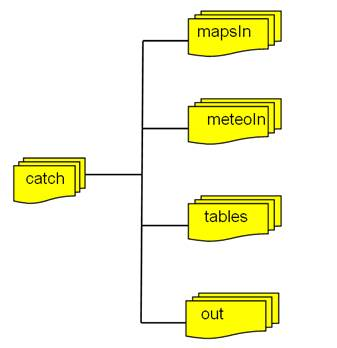

## Prepare the environment

Before you can run LISVAP, you need to:

1. Prepare base maps
2. Prepare input dataset
3. [Prepare the XML settings file](/lisflood-lisvap/3_2_LISVAP_settingsfile/)

All input to LISVAP is provided as maps (grid files in PCRaster format or maps in netCDF format). 

### 1. Base maps

LISVAP needs some base maps representing areas of simulation. These basemaps must be coherent with input dataset, which means having same area (or containing it), and projection.

The following Table lists input **base maps**. 

**Table:** *LISVAP base maps*

| Map name in settings file     | Default name           | Description                                       |
| ----------------------------- | ---------------------- | ------------------------------------------------- |
| **GENERAL**                   |                        |                                                   |
| MaskMap                       | area.nc                | Boolean map that defines model boundaries         |
| **TOPOGRAPHY**                |                        |                                                   |
| Dem                           | dem.nc                 | Elevation, in [m] above sea level                 |
| Lat                           | lat.nc                 | Latitude [decimal degrees]                        |
| Lon                           | lon.nc                 | Longitude [decimal degrees]                       |

Some parameters can be set as a single value (constant) in settings file or as a base input map in case they change for different regions of the simulation area.
Check [settings file reference](/lisflood-lisvap/3_2_settingsfile) for more details.

#### Generating base maps

On the repository, you can find some [base maps](https://github.com/ec-jrc/lisflood-lisvap/tree/master/basemaps) for the test case.

It is recommended to generate the input base maps depending on the specific use case, taking into account the spatial resolution required and the coordinate system. 
In the future, a more detailed documentation assisting in the generation of input base maps will be made available.  

### 2. Meteorological input datasets

LISVAP needs meteorological variables as input. Those should be provided as netCDF mapstacks (timeseries of 2D georeferenced variables).
The Table below lists all **meteorological input variables** that LISVAP can digest. However, not all of these need to be provided as demonstrated below in two examples.
 

**Table:** *LISVAP meteorological input variables*

| Map stack           | Default prefix | Description                                          |
| ------------------- | -------------- | ---------------------------------------------------- |
| **TEMPERATURE**     |                |                                                      |
| TMaxMaps            | tx             | Maximum daily temperature \[°C or K\]                |
| TMinMaps            | tn             | Minimum daily temperature \[°C or K\]                |
| **VAPOUR PRESSURE** |                |                                                      |
| TDewMaps            | td             | Average daily dew point temperature [°C or K]        |
| EActMaps            | pd             | Actual vapour pressure [mbar]                        |
| PSurfMaps           | ps             | Instantaneous sea level pressure [Pa]                |
| **WIND SPEED**      |                |                                                      |
| WindMaps            | ws             | Wind speed at 10 m height [m s-1]                    |
| WindUMaps           | wu             | Wind speed at 10 m height, U-component [m s-1]       |
| WindVMaps           | wv             | Wind speed at 10 m height, V-component [m s-1]       |
| **SUNSHINE**        |                |                                                      |
| SunMaps             | s              | Sunshine duration \[hours\]                          |
| CloudMaps           | c              | Cloud cover \[octas\]                                |
| **RADIATION**       |                |                                                      |
| RgdMaps             | rg             | Downward  surface solar radiation [J m-2 d]          |
| RNMaps              | rn             | Net thermal radiation \[J m-2 d\] (always negative!) |
| RdsMaps             | rds            | Downward short wave radiation \[W/m2\]               |
| RdlMaps             | rdl            | Down long wave radiation \[W/m2\]                    |
| RusMaps             | rus            | rus - up short wave radiation \[W/m2\]               |
| RulMaps             | rul            | rul - up long wave radiation \[W/m2\]                |
| **HUMIDITY**        |                |                                                      |
| QAirMaps            | huss          | 2 m instantaneous specific humidity [kg/kg]           |

In the following two example meteorological data sets that are used to run LISVAP. The first one is derived from the meteorological data collection from EFAS (European Flood Awaress System), 
and the second from [CORDEX](https://www.cordex.org/). We use those in the [LISVAP use cases section](https://ec-jrc.github.io/lisflood-lisvap/6_LISVAP_tests/) to demonstrate how to use LISVAP. 

   **Table:** *Meteorological input variables from EFAS data collection*

| Variable name                     |  Description                             |
| --------------------------------- | ---------------------------------------- |
| PD                                | Actual vapour pressure \[mbar\]          |
| RG                                | rgd - calculated solar radiation \[W/m2\]|
| TN                                | Minimum daily temperature \[deg C\]      |
| TX                                | Maximum daily temperature \[deg C\]      |
| WS                                | Wind speed at 10 m from surface \[m/s\]  |

   **Table:** *Meteorological input variables form the CORDEX data collection*

| Variable name                     |  Description                                    |
| --------------------------------- | ----------------------------------------------- |
| PS                                | Instantaneous sea level pressur \[Pa\]          |
| HUSS                              | 2 m instantaneous specific humidity \[kg/kg\]   |
| TN                                | Minimum daily temperature \[K\]                 |
| TX                                | Maximum daily temperature \[K\]                 |
| WS                                | Wind speed at 10 m from surface \[m/s\]         |
| RDS                               | Downward short wave radiation \[W/m2\]          |
| RDL                               | Down long wave radiation \[W/m2\]               |
| RUS                               | Up short wave radiation \[W/m2\]                |
| RUL                               | Up long wave radiation \[W/m2\]                 |

## Organisation of input data

It is up to the user how the input data are organised. However, it is advised to keep the base maps and meteorological input maps separated (i.e. store them in separate directories). 

For practical reasons the following input structure is suggested: 

- all meteorological input maps are in one directory (e.g. ‘meteoIn’)
- all base maps are in one directory (e.g. ‘mapsIn’)
- all tables are in one directory (e.g. ‘tables’)
- all output goes into one directory (e.g. ‘out’)

The following Figure illustrates this:
  

 

**Figure:** *Suggested file structure for LISVAP*.
